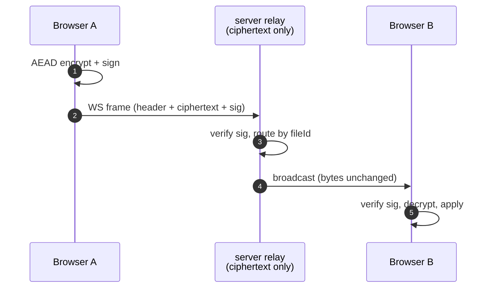

<div align="center">


# Kutup

**End-to-end encrypted, self-hosted Drive and federated Chat — with real-time collaboration.**


</div>

---

## What is Kutup?

Kutup is a privacy-first file storage, collaboration, and messaging platform you run on your own hardware. File content and metadata, document edits, Chat messages, attachment metadata, and protected Chat history are encrypted on the client before they leave it. The server retains the routing, account, timing, size, quota, and other operational metadata needed to provide the service, but not the protected plaintext or its keys. A random account master key is wrapped for password login and for the separate 24-word recovery path; unwrapped keys live only on the client.

What makes it different from "encrypted Dropbox" clones is the second word in that sentence: **collaboration**. Notes, code, spreadsheets, slides, and whiteboards all sync in real time between peers without giving up the E2EE invariant. The relay sees a stream of opaque AEAD-encrypted, Ed25519-signed frames — it can route them, persist them, and deliver them to other tabs, but it can't read a single byte of content.

Self-hosted by design. One authenticated federation stack carries encrypted Drive shares and Chat between Kutup servers without giving either backend the protected plaintext.

> **Release status:** Kutup is pre-production and has not published its first
> stable `v*` or `desktop-v*` release. The implementation and test gates are
> production-oriented, but operators should review the remaining release
> blockers in [`docs/roadmap.md`](docs/roadmap.md) before serving real users.

---

## Highlights

### One responsive workspace, designed for light and dark

The web client presents Files and Messages as peer workspaces in one responsive
navigation model rather than separate desktop and mobile products. Shared with
me and Trash remain Files views; Settings stays in the workspace shell; and the
role-gated Admin area uses a dedicated shell so administrative navigation never
stacks beside the Files/Messages sidebar. Light, Dark, and System are explicit
preferences applied from authentication through editors and public shares.

### Files & folders that the server can't read


Nested collections, drag-and-drop upload, public share links, per-user folder shares with read/upload/delete permissions, and a hard-baked encryption boundary. Filenames, MIME types, and folder structure are encrypted client-side. Stream upload via `crypto_secretstream_xchacha20poly1305` keeps large files out of memory. Deletes are recoverable: items land in a trash with restore + permanent delete and a configurable retention sweep (30 days by default). Storage backs onto SeaweedFS (S3-compatible).

### Live notes & code


CodeMirror 6 + Yjs CRDT for `.md`, `.txt`, and 20+ code formats (Go, TS, Rust, Python, C/C++, Java, Shell, …). Multi-user cursors, selection presence, awareness color picked by the user. Every edit is a Yjs binary update wrapped in an AEAD envelope — the server gets opaque ciphertext.

### Office docs — fully client-side


`.docx`, `.xlsx`, `.pptx` via [OnlyOffice](https://github.com/ONLYOFFICE), running entirely in the browser using the [CryptPad pattern](docs/onlyoffice.md). Document state is never decrypted server-side. Live cell-selection presence (peer ranges shown as translucent colored rectangles), per-user color, multi-tab differentiation, full conditional formatting, formulas, and charts.

### Whiteboards (Excalidraw)


`.excalidraw` files open in [Excalidraw](https://excalidraw.com/) with cross-tab sync. Last-write-wins per element via `versionNonce` + `reconcileElements`. Same E2EE envelope as everything else.

### Version history on every file


Every Save creates a versioned snapshot. Open the History sidebar in any editor, scroll back, restore. Named "Save version" entries are kept forever; anonymous saves age out (30 days OR 50 versions, whichever yields more). The endpoint is file-type-agnostic — notes, office, whiteboards all use the same plumbing.

### You own your keys


Multi-device with per-device Ed25519 keypairs (revocable individually). Each
Chat installation has an editable account-private name for recognition and a
small immutable numeric device ID used only for protocol routing; renaming an
installation does not rotate keys, replace sessions, or move history. A 24-word
BIP39 recovery phrase doubles as the second factor for account recovery.
Optional TOTP 2FA. A picked presence color follows you across notes and office
editors, on every tab.

### Federated E2EE Chat with continuous recovery

Chat is part of the responsive web app and is available at `/chat` after
sign-in:

- Direct conversations and Note to Self use pinned libsignal PQXDH, Triple
  Ratchet, and SPQR state; private groups use RFC 9420 OpenMLS.
- `username@server` addressing, message requests, blocking, account/device
  manifests, safety QR comparison, and contacts-only sealed delivery work
  across Kutup homeservers.
- Replies, reactions, author-authenticated edits and deletions, delivery/read
  state, typing, disappearing messages, expiry tombstones, and private local
  search are supported.
- Photos, files, camera capture, bounded voice notes, encrypted previews,
  manual lazy download, and in-app viewing use a dedicated Chat storage quota
  rather than the Drive quota.

Every durable display-history mutation enters an IndexedDB-backed encrypted
backup outbox. After account recovery, a genuinely empty browser automatically
verifies and restores the latest server-acknowledged base plus event tail, then
creates fresh Direct/MLS protocol state for new messages. Eligible protected
media restores lazily. This account-local backup is always on, has a dedicated
administrator-controlled quota (2 GiB by default), and does not restore device
keys, ratchets, MLS epochs, mailbox cursors, receipts, or pending sends.
Device-to-device history transfer is not supported.

---

## Quick Start

```sh
git clone https://github.com/kutupbt/kutup.git
cd kutup
cp .env.example .env
# Edit .env — set strong values for POSTGRES_PASSWORD, JWT_SECRET,
# S3_SECRET_KEY, ADMIN_ACCOUNT.
mkdir -p nginx/certs
openssl req -x509 -nodes -newkey rsa:2048 -days 365 \
  -keyout nginx/certs/privkey.pem -out nginx/certs/fullchain.pem \
  -subj /CN=localhost -addext subjectAltName=DNS:localhost,IP:127.0.0.1
docker compose up -d --build --wait
```

Open `https://localhost:38443`, accept the local self-signed certificate, log in with the credentials from `ADMIN_ACCOUNT`, save your generated recovery phrase, and you're in. HTTP on port `38080` redirects to HTTPS. The bootstrap account is the protected **break-glass admin** — it can't be demoted, disabled, or deleted; promote any further admins from inside the app. Use a publicly trusted certificate and normal ports for production; see the self-hosting guide.

Office editing works in the default Compose build. The build pulls an
immutable, verified client-side asset image from
[`kutupbt/kutup-office-assets`](https://github.com/kutupbt/kutup-office-assets);
no OnlyOffice DocumentServer or manual installer is required. The
`./install-onlyoffice.sh` script remains available for non-Docker frontend
development and air-gapped image preparation.

---

## CLI

`kutup` is a Rust CLI for the same E2EE primitives as the web — register, login, account recovery, ls, upload (resumable), download, sync, trash, share, versions, devices, 2fa, public-link consumption, file/folder rename. All operations are end-to-end encrypted in your shell; the server only ever sees ciphertext.

Scripting-friendly: every command honors a global `--json` flag (stdout is exactly one JSON document; prompts/progress/status go to stderr, and with `--json` even errors are emitted as JSON on stderr), and exit codes are differentiated — `0` ok, `1` generic, `2` usage, `3` auth/session, `4` not found, `5` network/server. Destructive commands prompt `[y/N]` and take `--yes` for non-interactive use.

**Build from source** (Rust ≥ 1.91.1):

```sh
git clone https://github.com/kutupbt/kutup.git
cd kutup
cargo build --release -p kutup-cli   # → target/release/kutup
install -m755 target/release/kutup ~/.local/bin/kutup
```

Tagged release binaries are built for Linux x86-64/ARM64, macOS Intel/Apple
Silicon, and Windows x86-64 and published on GitHub Releases (see
[`.github/workflows/release.yml`](.github/workflows/release.yml)).

### Common workflows

```sh
# Create an account (client-side crypto; prints a 24-word recovery phrase once).
kutup register --server https://your.kutup.host --email you@example.com --username you

# Login (interactive password prompt; password can also come from KUTUP_PASSWORD).
kutup login --server https://your.kutup.host --email you@example.com

# List your folders + files at the Drive root.
kutup ls
kutup ls <folder-id>           # contents of a sub-folder

# Forgot the password? Reset it with the 24-word recovery phrase
# (KUTUP_RECOVERY_PHRASE + KUTUP_PASSWORD for non-interactive use).
kutup recover --server https://your.kutup.host --email you@example.com

# Upload a file. The CLI's chunked stream encryption (5 MB blocks via
# crypto_secretstream) has NO browser-imposed size limit — multi-GB
# files (ISOs, raw video, datasets) work where the web upload chokes
# around ~2 GB and crashes the tab. File size is bounded by disk,
# not RAM. Interrupted uploads RESUME from the last 5 MB chunk when
# you rerun the same command (--no-resume restarts from zero).
kutup upload ./big-dataset.tar.gz <folder-id>
kutup upload ./local-dir <folder-id> --recursive

# Download a file. For collab-edited files (notes / office /
# whiteboards) returns the latest snapshot — same content the web
# shows, not the cold-start initial. Whiteboard image assets are
# re-inlined so the .excalidraw is self-contained.
kutup download <file-id>
kutup download <file-id> ./local/path/

# Bidirectional sync: recursive (sub-folders ↔ sub-collections), with
# real change detection — local edits re-upload, remote changes
# re-download, and concurrent edits produce a name.sync-conflict-<ts>
# copy instead of silently overwriting. Deletions propagate only with
# --delete; --dry-run previews without touching anything.
kutup sync ./local-folder <folder-id>
kutup sync ./local-folder <folder-id> --watch          # live fsnotify sync
kutup sync ./local-folder <folder-id> --watch --poll 60 # + poll remote every 60s
kutup sync ./local-folder <folder-id> --delete --dry-run

# Trash: deleted items are recoverable until the retention window ends.
kutup trash ls
kutup trash restore <id>
kutup trash empty --yes

# Rename a file or a folder (names are E2EE metadata; content untouched).
kutup mv <file-id> "new name.txt"
kutup mv <folder-id> "New folder name" --folder

# List versions. Restore is currently safe for CLI/sync-created files;
# live-collaboration snapshots need the web client's derived content-key path.
kutup versions list <file-id>
kutup versions restore <file-id> <version-id>

# Public-link consumption — no kutup login required for the URL itself.
kutup pub get https://your.kutup.host/s/<token>#key=<base64>
kutup pub download <url> <file-id>

# Discover the rest.
kutup --help
kutup version
```

The **>2 GB** path is the standout. Browser File API + Web Crypto streaming work in theory but practically wedge the tab at multi-GB sizes; the CLI streams `crypto_secretstream` (XChaCha20-Poly1305, 5 MB chunks) over a Rust reader, so it handles arbitrarily large files at constant ~5 MB memory.

---

## Architecture in 30 seconds

This file-collaboration example shows the common client-encryption boundary. Chat uses its own libsignal/OpenMLS protocols and an account-local encrypted backup rather than this document relay:



The relay can persist frames (`yjs_update`, `oo_op`, version blobs) but cannot decrypt them. Each file has a random key wrapped by its collection epoch; purpose-separated collaboration and blob keys are derived from that file/collection state, with no plaintext on the wire.

For the full picture (key hierarchy, login flow, federation model, storage layer, wire envelope spec): [docs/architecture.md](docs/architecture.md).

---

## Tech Stack

| Layer | Technology |
|-------|------------|
| Backend | Rust, [Axum 0.7](https://github.com/tokio-rs/axum) (HTTP + WebSocket), [sqlx](https://github.com/launchbadge/sqlx) (Postgres), [aws-sdk-s3](https://crates.io/crates/aws-sdk-s3), PostgreSQL 16 |
| CLI / crypto | Rust — `dryoc` + RustCrypto (Argon2id, XChaCha20-Poly1305 AEAD/secretstream, X25519 HPKE, Ed25519); `clap` CLI |
| Frontend | React 18, TypeScript 5.4, Vite 8, [Redux Toolkit 2](https://redux-toolkit.js.org/), [TailwindCSS](https://tailwindcss.com/) + [Radix UI](https://www.radix-ui.com/) |
| Frontend crypto | Canonical Rust via `kutup-crypto-wasm`; a narrow [libsodium-wrappers-sumo](https://github.com/jedisct1/libsodium.js) adapter streams large secretstream blobs and supplies browser CSPRNG bytes |
| Realtime collab | Yjs 13 + `y-codemirror.next` (notes); OnlyOffice + `x2t` WASM (office); `@excalidraw/excalidraw` (whiteboards); a server relay with per-frame AEAD envelopes |
| Chat | libsignal Direct/Note to Self, OpenMLS private groups, IndexedDB state, continuous E2EE history/media backup |
| Storage | [SeaweedFS](https://github.com/seaweedfs/seaweedfs) (S3-compatible) |
| Infrastructure | Docker Compose, Nginx (TLS termination + static asset serving) |
| Testing | Playwright (e2e), `cargo test` (Rust unit + crypto vectors), Vitest (frontend unit), actionlint and repository documentation checks |

---

## Documentation

| | |
|---|---|
| Self-hosting (TLS, backups, reverse proxies, env vars) | [docs/self-hosting.md](docs/self-hosting.md) |
| System architecture (key hierarchy, federation, collab wire) | [docs/architecture.md](docs/architecture.md) |
| Chat protocol, encrypted media, and continuous backup | [docs/chat-protocol.md](docs/chat-protocol.md), [docs/chat-media.md](docs/chat-media.md), [docs/chat-backup.md](docs/chat-backup.md) |
| Chat threat models | [docs/chat-security-threat-model.md](docs/chat-security-threat-model.md), [docs/chat-media-security-threat-model.md](docs/chat-media-security-threat-model.md), [docs/chat-backup-security-threat-model.md](docs/chat-backup-security-threat-model.md) |
| OnlyOffice integration & CryptPad-pinned bundle | [docs/onlyoffice.md](docs/onlyoffice.md) |
| REST API reference | [docs/api.md](docs/api.md) |
| Local dev setup, code conventions, project structure | [docs/contributing.md](docs/contributing.md) |
| Local-first testing and CI workflow routing | [docs/contributing.md](docs/contributing.md), [tests/e2e/README.md](tests/e2e/README.md) |
| Web UI architecture, theme system, and responsive rules | [docs/frontend.md](docs/frontend.md) |
| Documentation map and document-status conventions | [docs/README.md](docs/README.md) |
| Machine-readable OpenAPI document | `/api-docs/openapi.json` on a running stack (interactive Swagger UI is not bundled) |

---

## Acknowledgements

Kutup's design and several of its core technical choices are directly inspired by — and in places adapted from — these projects:

- **[OnlyOffice](https://github.com/ONLYOFFICE)** — AGPL `documenteditor` / `spreadsheeteditor` / `presentationeditor` builds power kutup's collaborative office editing. The bridged iframe + `x2t` WASM converter approach is taken straight from upstream.
- **[CryptPad](https://github.com/cryptpad/cryptpad)** — the pattern of running OnlyOffice client-only with all document state encrypted in the browser is theirs. kutup's office collab follows their playbook (see [docs/onlyoffice.md](docs/onlyoffice.md)).
- **[Ente](https://github.com/ente-io/ente)** — the E2EE primitives (libsodium, the master/collection/file-key hierarchy, Argon2id-derived login keys, streaming chunk format) are modeled on Ente's open-source clients.
- **[Excalidraw](https://github.com/excalidraw/excalidraw)** — kutup's whiteboard editor embeds the upstream `@excalidraw/excalidraw` React component. The status-driven asset flow (`pending` → upload → `saved` → peer fetch on reconcile) and the `versionNonce`-based last-write-wins reconciliation come straight from upstream's collab model.

Where code, schemas, or protocol details were copied or closely adapted, the relevant files carry the upstream license headers.

---

## License & brand

**AGPL-3.0-only** — Copyright (c) 2026 Alperen Albayrak. See [LICENSE](LICENSE).

The OnlyOffice subtree under `frontend/public/onlyoffice/` and the kutup ↔ OnlyOffice bridge in `frontend/src/components/editors/office/` are licensed AGPL-3.0-or-later (so they can link the OnlyOffice client). Full license boundary: [frontend/public/onlyoffice/LICENSE.md](frontend/public/onlyoffice/LICENSE.md).

The **kutup name, the three-diamond logo, and other brand assets** are not granted by the AGPL — see [TRADEMARK.md](TRADEMARK.md) for what's OK without asking (articles, integration references, screenshots) and what needs permission (selling merch, distributing forks under our name).
